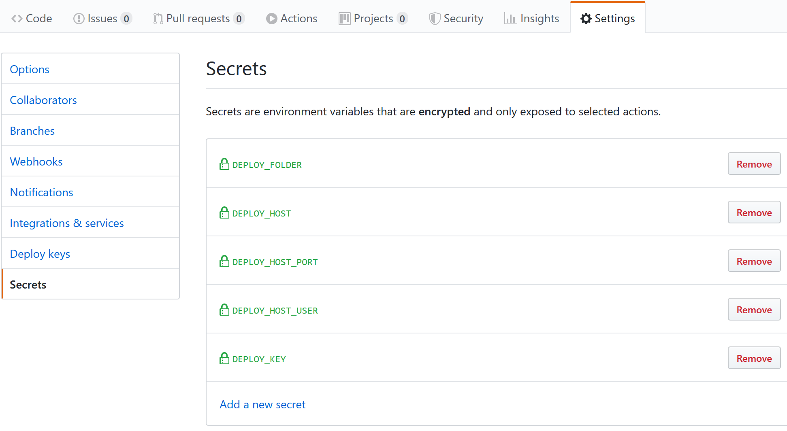

# github-actions-test

[Github Actions](https://help.github.com/en/categories/automating-your-workflow-with-github-actions) 功能的一个测试项目。

试了下Github新推出的[Github Actions](https://help.github.com/en/categories/automating-your-workflow-with-github-actions) beta版功能，勉强实现了简单CICD。

说下感受：CI挺好用的，跑自动测试不用通过其他平台了，控制台输出也很友好；CD差点意思，没找到比较优雅的方法，勉强用SCP实现自动部署，等待后续官方更新完善。

### Nodejs cicd的简单例子

github action配置文件：[nodejs.yml](.github/workflows/nodejs.yml)

push触发

功能：

- 自动测试
- 自动部署到服务器
- 自动部署目标文件到github pages，生成`gh-pages`分支

需要在**Setting**-**Secrets**配置以下变量：

- ` DEPLOY_HOST`: 部署服务器地址
- `DEPLOY_HOST_PORT`: 部署服务器ssh端口
- `DEPLOY_HOST_USER`: 有权限的部署用户
- `DEPLOY_KEY`: 用户对应的登陆私钥
- `DEPLOY_FOLDER`: 部署目录，会复制静态文件到这里，需要事先在服务器配置好web服务器，比如nginx需要配置静态服务

### 成果

- [github pages页面](https://imyon.github.io/github-actions-test/)
- [服务器部署页面](https://github-actions-test.uuzsama.me)
